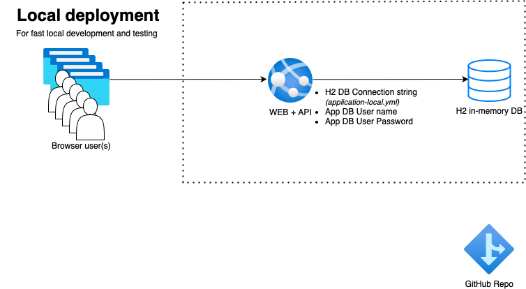

# Spring Boot Todo App on App Service


## CI/CD Status:

[](https://github.com/martinabrle/app-service-java-demo/actions/workflows/01-validation-app.yml)

[](https://github.com/martinabrle/app-service-java-demo/actions/workflows/02-validation-infra.yml)

[](https://github.com/martinabrle/app-service-java-demo/actions/workflows/30-sast-codeql.yml)

[](https://github.com/martinabrle/app-service-java-demo/actions/workflows/31-sast-semgrep.yml)

[](https://github.com/martinabrle/app-service-java-demo/actions/workflows/32-sast-spotbugs.yml)

[](https://github.com/martinabrle/app-service-java-demo/actions/workflows/40-dast-owaspzap.yml)

[](https://github.com/martinabrle/app-service-java-demo/actions/workflows/50-dependency-review.yml)

[](https://github.com/martinabrle/app-service-java-demo/actions/workflows/70-continuous-integration.yml)

[](https://github.com/martinabrle/app-service-java-demo/actions/workflows/80-continuous-delivery.yml)

[](https://github.com/martinabrle/app-service-java-demo/actions/workflows/85-continuous-delivery-production.yml)

[](https://github.com/martinabrle/app-service-java-demo/actions/workflows/98-infra.yml)

## Introduction
This is a simple Todo List demo app, built with Java 11, Springboot and Thymeleaf frameworks. It can run locally with an embeded H2 DB (no configuration needed), with a local Postgresql Database for more realistic testing, locally with a Postgresql backend in Azure or fully deployed into Azure. When deployed into Azure, it will be taking advantage of Log Analytics Workspace and Application Insights for monitoring, Keyvault for managing secrets, AppService for running the app, PostgresQL Flexible Server for storing the data in a resilient manner and GitHub Actions for CI/CD. With AppService deployment, we are using deployment slots for staging and production environments. GitHub actions in turn use just one protected environment, PRODUCTION, for a gated deployment into production. Most of the features used here work with a free tier of Azure services, so you can try it out without incurring any costs. On the Github side, majority of the features will work with a free version of GitHub Actions. Protected environments (gated PRODUCTION deployment)will only work with a public repo or with a paid version of GitHub, GitHub Enterprise.

## Running the app locally with H2 database


You can run the app locally with an in-memory H2 database for both development and testing purposes, by following the next steps:
* Install Java 11 and Maven locally
* Run the command line of your choice and make sure that Java 11 SDK is installed and in your path
    ```
    javac -version
    ```
* Clone the repo
    ```
    git clone 
    ```
* Change the current directory to the application's root directory
    ```
    cd ./todo
    ```
* Set local variables 
    ```
    export PORT=8080
    export SPRING_ACTIVE_PROFILE=local
    export LOAD_DEMO_DATA=true
    ```
    You can review various springboot profiles (application*.yml) under [[./todo/src/main/resources/]](./todo/src/main/resources/) to understand different deployment options.

* Test 
    ```
    ./mvnw -B clean package
    ```
* Run the application
    ```
    ./mvnw spring-boot:run
    ```
* Open your browser and navigate to http://localhost:8080 to test the application. You can view http://localhost:8080/info to see more technical details. On http://localhost:8080/actuator and http://localhost:8080/actuator/health, you can inspect health related application information, provided by Springboot's Actuator framework.

## Next steps:
Now you can continue in [docs](https://github.com/martinabrle/app-service-java-demo/tree/main/docs/) directory and try deploying the app into Azure App Service, either manually or using CI/CD GitHub Actions.

## Note:
Please review GitHub actions 30-* to 50-* for examples on implementing dependency scanning, static and dynamics analysis etc.