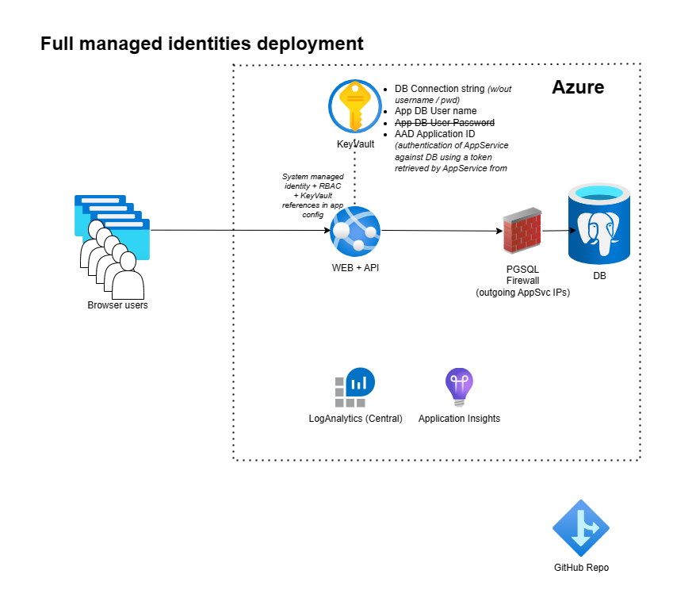

# Spring Boot Todo App on App Service
## Deployment with full managed identities usage (Bicep)



* Start the command line, clone the repo using ```git clone https://github.com/martinabrle/app-service-java-demo.git``` and change your current directory to ```app-service-java-demo/scripts``` directory:
    ```
    cd ./app-service-java-demo/scripts
    ```
* Log in into Azure from the command line using ```az login``` ([link](https://docs.microsoft.com/en-us/cli/azure/authenticate-azure-cli))
* List available Azure subscriptions using ```az account list -o table``` ([link](https://docs.microsoft.com/en-us/cli/azure/account#az-account-list))
* Select an Azure subscription to deploy the infra into, using ```az account set -s 00000000-0000-0000-0000-000000000000```
  ([link](https://docs.microsoft.com/en-us/cli/azure/account#az-account-set)); replace ```00000000-0000-0000-0000-000000000000``` with Azure subscription Id you will deploy into
* Set environment variables:
    ```
    AZURE_LOCATION="eastus"
    LOG_ANALYTICS_WRKSPC_NAME="{{{REPLACE_WITH_LOG_WORKSPACE_NAME}}}"
    LOG_ANALYTICS_WRKSPC_SUBSCRIPTION_ID="{{{REPLACE_WITH_LOG_WORKSPACE_SUBSCRIPTION_ID}}}"
    LOG_ANALYTICS_WRKSPC_RESOURCE_GROUP="{{{REPLACE_WITH_LOG_WORKSPACE_RESOURCE_GROUP}}}"
    LOG_ANALYTICS_WRKSPC_RESOURCE_TAGS='{ \"Department\": \"RESEARCH\", \"CostCentre\": \"DEV\", \"DeleteNightly\": \"true\",  \"DeleteWeekly\": \"true\", \"Architecture\": \"LOG-ANALYTICS\"}'
    
    PGSQL_NAME="{{{REPLACE_WITH_PGSQL_NAME}}}"
    PGSQL_SUBSCRIPTION_ID="{{{REPLACE_WITH_PGSQL_SUBSCRIPTION_ID}}}"
    PGSQL_RESOURCE_GROUP="{{{REPLACE_WITH_PGSQL_RESOURCE_GROUP}}}"
    PGSQL_RESOURCE_TAGS='{ \"Department\": \"RESEARCH\", \"CostCentre\": \"DEV\", \"DeleteNightly\": \"false\",  \"DeleteWeekly\": \"false\", \"Architecture\": \"PGSQL\"}'

    APP_SERVICE_NAME="{{{REPLACE_WITH_APP_SERVICE_NAME}}}"
    APP_SERVICE_RESOURCE_GROUP="{{{REPLACE_WITH_APP_SERVICE_RESOURCE_GROUP}}}"
    APP_SERVICE_RESOURCE_TAGS='{ \"Department\": \"RESEARCH\", \"CostCentre\": \"DEV\", \"DeleteNightly\": \"false\",  \"DeleteWeekly\": \"false\", \"Architecture\": \"APP-SERVICE\"}'

    DBA_GROUP_NAME="All TEST PGSQL Admins"
    DBA_GROUP_ID=`az ad group show --group "${DBA_GROUP_NAME}" --query '[id]' -o tsv`

    DB_NAME="tododb"
    DB_NAME_STAGING="stagingtododb"

    DB_USER_MI_NAME="todoapi"
    DB_USER_MI_STAGING_NAME="stagingtodoapi"
    clientIPAddress=`dig +short myip.opendns.com @resolver1.opendns.com.`
    ```
* Deploy resource groups for all services:
    ```
    az deployment sub create \
        --l $AZURE_LOCATION \
        --template-file ./templates/resource_groups.bicep \
        --parameters location="${AZURE_LOCATION}" \
                    appServiceRG="${APP_SERVICE_RESOURCE_GROUP}" \
                    appServiceTags="${APP_SERVICE_RESOURCE_TAGS}" \
                    pgsqlSubscriptionId="${PGSQL_SUBSCRIPTION_ID}" \
                    pgsqlRG="${PGSQL_RESOURCE_GROUP}" \
                    pgsqlTags="${PGSQL_RESOURCE_TAGS}" \
                    logAnalyticsSubscriptionId="${LOG_ANALYTICS_WRKSPC_SUBSCRIPTION_ID}" \
                    logAnalyticsRG="${LOG_ANALYTICS_WRKSPC_RESOURCE_GROUP}" \
                    logAnalyticsTags="${LOG_ANALYTICS_WRKSPC_RESOURCE_TAGS}"
    ```
* Deploy all services:
    ```
    az deployment group create \
        --resource-group $APP_SERVICE_RESOURCE_GROUP \
        --template-file ./templates/main.bicep \
        --parameters appServiceName="${APP_SERVICE_NAME}" \
                     appServicePort=443 \
                     appServiceTags="${APP_SERVICE_RESOURCE_TAGS}" \
                     pgsqlName="${PGSQL_NAME}" \
                     pgsqlAADAdminGroupName="${DBA_GROUP_NAME}" \
                     pgsqlAADAdminGroupObjectId="${DBA_GROUP_ID}" \
                     pgsqlDbName="${DB_NAME}" \
                     pgsqlStagingDbName="${DB_NAME_STAGING}" \
                     pgsqlSubscriptionId="${PGSQL_SUBSCRIPTION_ID}" \
                     pgsqlRG="${PGSQL_RESOURCE_GROUP}" \
                     pgsqlTags="${PGSQL_RESOURCE_TAGS}" \
                     logAnalyticsName="${LOG_ANALYTICS_WRKSPC_NAME}" \
                     logAnalyticsSubscriptionId="${LOG_ANALYTICS_WRKSPC_SUBSCRIPTION_ID}" \
                     logAnalyticsRG="${LOG_ANALYTICS_WRKSPC_RESOURCE_GROUP}" \
                     logAnalyticsTags="${LOG_ANALYTICS_WRKSPC_RESOURCE_TAGS}" \
                     healthCheckPath="" \
                     dbUserName="${DB_USER_MI_NAME}" \
                     dbStagingUserName="${DB_USER_MI_STAGING_NAME}" \
                     deploymentClientIPAddress="${clientIPAddress}" \
                     location="${AZURE_LOCATION}"
    ```
* Log-in into the newly created Postgresql server as an AAD admin user (assuming the current user is a member of the DBA group):
    ```
    export PGPASSWORD=`az account get-access-token --resource-type oss-rdbms --query "[accessToken]" --output tsv`
    ```
* Create databases:
    ```
    ./create_aad_db.sh -s "${PGSQL_NAME}" -d "${DB_NAME}" -a "${DBA_GROUP_NAME}"
    ./create_aad_db.sh -s "${PGSQL_NAME}" -d "${DB_NAME_STAGING}" -a "${DBA_GROUP_NAME}"
    psql --set=sslmode=require -h ${PGSQL_NAME}.postgres.database.azure.com -p 5432 -d "${DB_NAME}" -U "${DBA_GROUP_NAME}" --file=./create_todo_table.sql
    psql --set=sslmode=require -h ${PGSQL_NAME}.postgres.database.azure.com -p 5432 -d "${DB_NAME_STAGING}" -U "${DBA_GROUP_NAME}" --file=./create_todo_table.sql
    ```
* Assign a newly created AppService's AppId and staging AppService's AppId to a variable:
    ```
    DB_APP_USER_APP_ID=`az ad sp list --display-name $APP_SERVICE_NAME --query "[?displayName=='${APP_SERVICE_NAME}'].appId" --out tsv`
    DB_APP_USER_STAGING_APP_ID=`az ad sp list --display-name "${APP_SERVICE_NAME}/slots/staging" --query "[?displayName=='${APP_SERVICE_NAME}/slots/staging'].appId" --out tsv`
    ```
* Create AAD DB users:
    ```
    ./create_aad_pgsql_user.sh -s "${PGSQL_NAME}" \
                               -d "${DB_NAME}" \
                               -a "${DBA_GROUP_NAME}" \
                               -n "${DB_USER_MI_NAME}" \
                               -o "${DB_APP_USER_APP_ID}"

    ./create_aad_pgsql_user.sh -s "${PGSQL_NAME}" \
                               -d "${DB_NAME_STAGING}" \
                               -a "${DBA_GROUP_NAME}" \
                               -n "${DB_USER_MI_STAGING_NAME}" \
                               -o "${DB_APP_USER_STAGING_APP_ID}"
    ```

* Change your current directory to ```app-service-java-demo/todo```:
    ```
    cd ../todo
    ```
* Build the app using
    ```
    ./mvnw clean
    ```
    and
    ```
    PORT=9901
    ./mvnw -B package
    ```
* You can deploy the generated .jar package either using Maven or AZ command-line-utility (CLI):
    * Maven:
        * Configure the application with Maven Plugin:
            ```
            ./mvnw com.microsoft.azure:azure-webapp-maven-plugin:2.2.0:config
            ```
            This maven goal will first authenticate with Azure and than it will ask you which App Service (or in other words, which Java WebApp) do you want to deploy the app into. Confirm the selection and you will find an updated configuration in your application project's ```pom.xml```.
        * Deploy the application:
             ```
             ./mvnw azure-webapp:deploy
             ```
    * AZ CLI:
        ``` 
        az webapp deploy --resource-group $APP_SERVICE_RESOURCE_GROUP --name $APP_SERVICE_NAME --slot staging --type jar --src-path ./target/todo-0.0.1.jar
        ```

* Open the app's URL (```https://${APP_SERVICE_NAME}.azurewebsites.net/```) in the browser and test it by creating and reviewing tasks
* Explore the SCM console on (```https://${APP_SERVICE_NAME}.scm.azurewebsites.net/```); check logs and bash options
* Review an AppService configuration to see that no App Password is being used
* Delete previously created resources using ```az group delete -n $APP_SERVICE_RESOURCE_GROUP``` ([link](https://docs.microsoft.com/en-us/cli/azure/group?view=azure-cli-latest#az-group-delete))
* If you created a new Log Analytics Workspace, delete it using  ```az group delete -n $LOG_ANALYTICS_WRKSPC_RESOURCE_GROUP``` ([link](https://docs.microsoft.com/en-us/cli/azure/group?view=azure-cli-latest#az-group-delete))
